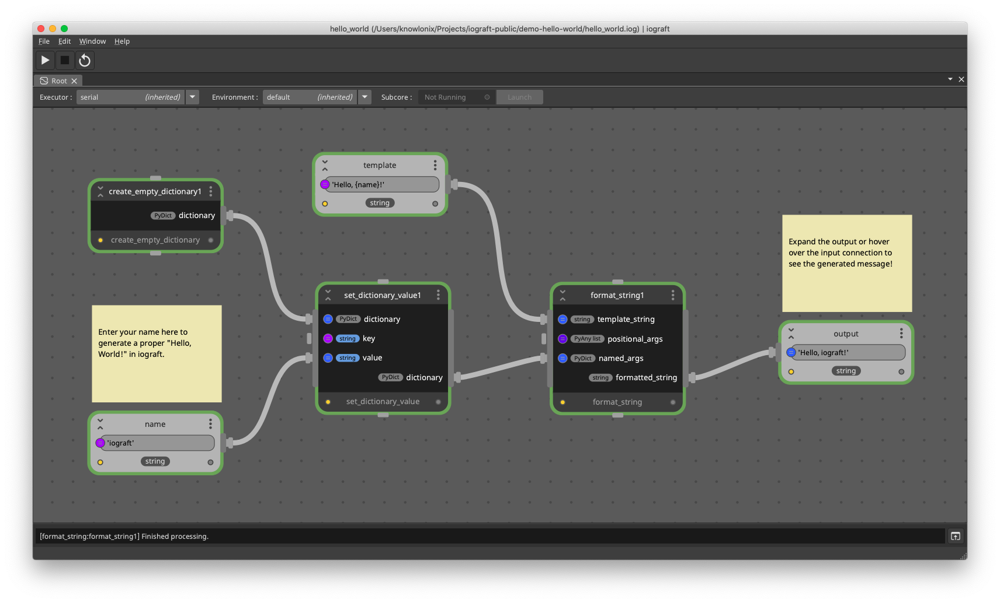

# iograft Hello World Demo

This repository provides an simple "Hello, World!" introductory example of an iograft graph.

Given an input `name`, this graph outputs a corresponding message based on that name input.

This graph is built with ONLY the built-in nodes that come with iograft.

## Running the Demo

In order to run this demo, first clone or download the repository. Then open the "hello_world.iog" graph file in iograft.

The only value that needs to be set on the graph in order to execute is the `name` graph input. Set this to your name, and process the graph.

Once processed, hover over the `format_string` output connection or expand the `output` graph output to see the generated message!
